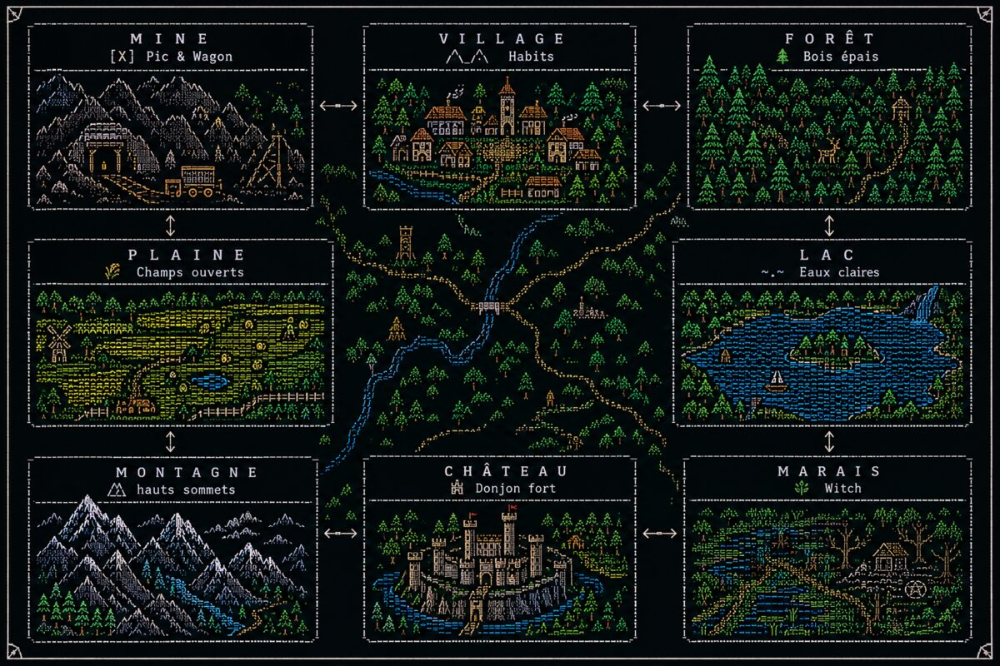

<div align="center">

# ⚔️ Aux confins d'Athanor

### Portage HTML / CSS / JavaScript du RPG textuel original écrit en Go


*Un monde tissé de forêts, de mines, de marais et de légendes — jouable directement dans votre navigateur, sans rien installer.*

</div>

<p align="center">
  
</p>


---

## 🚀 Démarrage rapide

```bash
# Aucune installation, aucune dépendance : ouvrez simplement le fichier
open athanor.html        # macOS
start athanor.html       # Windows
xdg-open athanor.html    # Linux
```

Ou glissez-déposez `athanor.html` dans n'importe quel navigateur moderne. C'est tout.

---

## Sommaire

1. [Lancer le jeu](#1-lancer-le-jeu)
2. [Présentation générale](#2-présentation-générale)
3. [Création du personnage](#3-création-du-personnage)
4. [Statistiques du joueur](#4-statistiques-du-joueur)
5. [Carte du monde](#5-carte-du-monde)
6. [Système de combat](#6-système-de-combat)
7. [Table des monstres](#7-table-des-monstres)
8. [Les boss](#8-les-boss)
9. [Le Village et ses services](#9-le-village-et-ses-services)
10. [Inventaire et équipement](#10-inventaire-et-équipement)
11. [La Forge et les recettes](#11-la-forge-et-les-recettes)
12. [Le Shop](#12-le-shop)
13. [L'Auberge](#13-lauberge)
14. [La Sorcière du Marais](#14-la-sorcière-du-marais)
15. [Le Labyrinthe de la Mine](#15-le-labyrinthe-de-la-mine)
16. [La Bibliothèque](#16-la-bibliothèque)
17. [Système de niveaux et titres](#17-système-de-niveaux-et-titres)
18. [Victoire, défaite et game over](#18-victoire-défaite-et-game-over)
19. [Structure technique du fichier](#19-structure-technique-du-fichier)
20. [Différences avec la version Go originale](#20-différences-avec-la-version-go-originale)
21. [Limitations connues](#21-limitations-connues)
22. [Pistes d'amélioration](#22-pistes-damélioration)

---

## 1. Lancer le jeu

Le jeu tient dans un **unique fichier autonome** : `athanor.html`.

- Aucune installation, aucune dépendance, aucun serveur requis.
- Double-cliquez sur le fichier ou ouvrez-le avec `Ctrl+O` / `Cmd+O` dans n'importe quel navigateur moderne (Chrome, Firefox, Safari, Edge).
- Le jeu démarre immédiatement sur l'écran de création de personnage.
- **Aucune sauvegarde** : recharger la page relance une nouvelle partie depuis le début (voir [§21](#21-limitations-connues)).

---

## 2. Présentation générale

"Aux confins d'Athanor" est un RPG textuel à choix multiples, entièrement piloté par des boutons (l'équivalent des menus numérotés du programme Go original, adaptés à une interface cliquable). Le joueur :

- crée un personnage (nom, race, classe) ;
- explore un monde de 8 zones interconnectées autour d'un Village central ;
- affronte des monstres propres à chaque zone dans un système de combat au tour par tour ;
- gagne de l'expérience, monte de niveau, récolte des ressources ;
- fabrique des armes et armures à la Forge, achète et vend au Shop ;
- peut affronter deux boss cachés (le Tableau maudit et Valenkor le Revenant) ;
- peut se divertir (et perdre de l'argent, ou pire) à l'Auberge ;
- peut consulter une Bibliothèque contenant le lore complet du monde.

L'interface reprend l'esprit "console" du jeu d'origine : un bandeau de statistiques toujours visible en haut de l'écran, un journal de texte coloré (façon terminal ANSI), et des boutons de choix remplaçant la saisie clavier.

---

## 3. Création du personnage

Au lancement, trois informations sont demandées successivement :

| Étape | Détail |
|---|---|
| **Nom** | Libre. Si vide, "Aventurier" est utilisé par défaut. |
| **Race** | `Humain`, `Elf`, `Orc` ou `Slime` (la première lettre seule est aussi acceptée : h/e/o/s). |
| **Classe** | `Guerrier`, `Mage` ou `Archer` (première lettre acceptée : g/m/a). |

Les valeurs de race et de classe ne sont pas sensibles à la casse. Une race ou classe non reconnue applique des valeurs par défaut neutres (l'écran vous prévient dans ce cas).

### Bonus par race

| Race | Santé | Endurance | Défense | Attaque de base |
|---|---|---|---|---|
| Humain | 100 | 60 | 5 | 10 |
| Elf | **1** ⚠️ | 65 | 3 | 10 |
| Orc | 100 | 50 | 6 | 14 |
| Slime | 50 | 25 | 1 | 5 |

> ⚠️ **La valeur de santé de l'Elf (1 PV) est reprise telle quelle du code Go original**, qui contient visiblement un bug de conception (un commentaire dans le code source indique que la valeur devrait être 20). Ce portage privilégie la fidélité au comportement réel du programme plutôt qu'une correction silencieuse. Jouer un Elf est donc, en l'état, extrêmement risqué.

### Bonus par classe

| Classe | Santé | Endurance | Défense | Dégâts bonus | Arme de départ |
|---|---|---|---|---|---|
| Mage | +0 | +25 | +0 | +0 | Mains |
| Guerrier | +10 | +5 | +3 | +5 | Épée en bois |
| Archer | +20 | +5 | +0 | +2 | Lance pierre |

Les stats finales du personnage sont la somme race + classe. L'arme de départ est automatiquement ajoutée à l'inventaire et équipée.

---

## 4. Statistiques du joueur

Affichées en permanence dans le bandeau supérieur :

- **Nom** — identifiant du personnage
- **Race / Classe** — affichage combiné
- **Niveau** et **Titre** (voir [§17](#17-système-de-niveaux-et-titres))
- **HP** — points de vie (recalculés à chaque combat, voir plus bas)
- **Endurance** — jauge consommée par les attaques en combat
- **Attaque** — statistique de base utilisée dans les formules de dégâts
- **Or** — monnaie du jeu
- **Exp** — expérience actuelle / expérience requise pour le prochain niveau

> Comme dans la version Go, la Santé et l'Endurance ne sont **pas persistantes entre deux combats** : chaque combat démarre avec la valeur "maximale" actuelle du joueur. Seules deux choses réduisent ces valeurs de façon durable : perdre un combat (perte d'un niveau) et boire la potion magique de l'Auberge (perte permanente d'1 PV).

---

## 5. Carte du monde

Le monde est composé de 8 lieux formant un anneau, avec le Village comme unique point d'accès central :

```
+---------+   +---------+   +---------+
|  MINE   |<->| VILLAGE |<->|  FORÊT  |
+---------+   +---------+   +---------+
     ^                            ^
     v                            v
+---------+                  +---------+
| PLAINE  |                  |   LAC   |
+---------+                  +---------+
     ^                            ^
     v                            v
+---------+   +---------+   +---------+
|MONTAGNE |<->| CHÂTEAU |<->| MARAIS  |
+---------+   +---------+   +---------+
```

Un bouton **"🗺 Voir la carte"** est disponible depuis presque tous les écrans principaux (Village, chaque zone d'exploration, Shop, Forge, Auberge, Bibliothèque, cabane de la Sorcière) et affiche une illustration complète de la carte. Fermer la carte ramène **exactement à l'écran d'où elle a été ouverte** — jamais au Village par défaut.

### Règle d'accès au Village

Conformément au comportement du jeu original, **le Village n'est directement accessible que depuis la Forêt et la Mine**. Depuis la Plaine, la Montagne, le Lac, le Château ou le Marais, il faut repasser par les zones voisines pour rejoindre le Village — il n'y a pas de raccourci "retour au village" générique.

### Table de navigation complète

| Zone | Monstres | Connexions | Particularité |
|---|---|---|---|
| **Village** | — | Forêt, Mine | Shop, Forge, Bibliothèque, Auberge, Inventaire |
| **Forêt** | Loup, Nain de jardin | Village, Lac | — |
| **Mine** | Canari, Gobelin | Plaine, Village | Labyrinthe des galeries |
| **Plaine** | Steve, René (la taupe) | Montagne, Mine | — |
| **Montagne** | Ours, Sherpa | Plaine, Château | — |
| **Lac** | Poisson rouge, Sirène | Marais, Forêt | Boss caché : Valenkor |
| **Château** | Gargouille, Chevalier | Montagne, Marais | Boss : Tableau de la Joconde |
| **Marais** | Chat noir, Liche | Lac, Château | Cabane de la Sorcière |

---

## 6. Système de combat

Le combat est **au tour par tour**, entièrement automatique côté monstre.

### Déroulement d'un tour

1. Le joueur choisit une action parmi ses **3 attaques de classe** ou l'utilisation d'une **potion**.
2. Si l'endurance est insuffisante pour l'attaque choisie, un **"Coup de poing"** de secours est automatiquement utilisé à la place (dégâts égaux à l'attaque brute, coût nul).
3. Il y a **10% de chance de coup critique**, qui double les dégâts infligés.
4. Une **Potion de Force** active, si utilisée au tour précédent, double également les dégâts du prochain coup porté.
5. Le monstre riposte automatiquement avec son attaque nommée (ex. "Griffure", "Morsure"...), sauf s'il vient d'être achevé.
6. Le combat se termine dès que l'un des deux camps atteint 0 PV ou moins.

### Attaques par classe

| Classe | Attaque 1 | Attaque 2 | Attaque 3 (repli) |
|---|---|---|---|
| **Mage** | Boule de feu (×2 ATK, 25 endu) | Coup de baguette (×1 ATK, 8 endu) | Coup de pieds (×1.1 ATK, 5 endu) |
| **Guerrier** | Coup d'épée (×1.6 ATK, 18 endu) | Lancer de poussière (×1.1 ATK, 10 endu) | Coup de poing (×1 ATK, 0 endu) |
| **Archer** | Tir (×1.5 ATK, 15 endu) | Lancer de projectile (×1.3 ATK, 12 endu) | Coup de pieds (×1.1 ATK, 5 endu) |

`ATK` correspond à l'attaque de base du joueur **+ le bonus de l'arme équipée** (voir tableau des armes ci-dessous).

### Bonus de dégâts par arme équipée

| Arme | Bonus |
|---|---|
| Mains / Épée en bois / Lance pierre | +1 |
| Épée en fer | +5 |
| Baguette magique | +5 |
| Arc en bois | +5 |
| Épée en fer améliorée | +10 |
| Bâton de sorcier | +10 |
| Arc en bambou | +10 |

### Bonus de points de vie par armure équipée (pool de combat uniquement)

| Armure | PV additionnels en combat |
|---|---|
| Armure en cuir | +50 |
| Armure en fer | +100 |
| Armure en fer améliorée | +200 |
| Armure magique | +350 |

### Potions utilisables en combat

| Potion | Effet |
|---|---|
| **Potion de Soin** | Restaure 50 % des PV maximum du pool de combat actuel |
| **Potion de Dégat** | Inflige immédiatement `2 × Attaque du joueur` dégâts au monstre |
| **Potion de Force** | Double les dégâts de la **prochaine** attaque portée |

Les potions doivent être achetées au préalable auprès de la Sorcière ([§14](#14-la-sorcière-du-marais)) et sont consommées à l'usage.

---

## 7. Table des monstres

Chaque monstre possède des statistiques calculées selon **3 paliers de niveau du joueur** : niveau ≤ 10, niveau 11–25, niveau > 25. Plus le joueur progresse, plus les monstres (même ceux des premières zones) deviennent redoutables — il n'y a pas de plafond.

| Monstre | Zone | Butin | Attaque nommée |
|---|---|---|---|
| Loup | Forêt | Bois | Hurlement |
| Nain de jardin | Forêt | Bambou | Coup de chapeau |
| Canari | Mine | Ficelle | Piou Piou |
| Gobelin | Mine | Fer | Morsure |
| Steve | Plaine | Bois | PvP Cristal |
| René (la taupe) | Plaine | Bambou | Piétisol |
| Ours | Montagne | Cuir | Griffure |
| Sherpa | Montagne | Bois | Coup de piolet |
| Poisson rouge | Lac | Cuir | Trempette |
| Sirène | Lac | Ficelle | Chant envoûtant |
| Gargouille | Château | Bambou | Cracher de poison |
| Chevalier | Château | Fer | Coup d'épée |
| Chat noir | Marais | Cuir | Coup de Griffe |
| Liche | Marais | Ficelle | Laser Mortel |

<details>
<summary><b>🧮 Formules de calcul détaillées (fidèles au code source) — cliquer pour déplier</b></summary>

<br>

Les monstres se répartissent en deux familles de formules selon leur "poids" (légers/lourds), avec un facteur `k` dépendant du niveau du joueur et du palier :

- **Palier 1** (niveau ≤ 10) : `k = niveau − 1`
- **Palier 2** (niveau 11–25) : `k = niveau − 10` (exception : la Liche utilise `niveau − 1` pour son attaque, fidèle à une particularité du code d'origine)
- **Palier 3** (niveau > 25) : `k = niveau − 25`

| Famille | PV (palier 1 / 2 / 3) | Attaque (palier 1 / 2 / 3) | Exp (palier 1 / 2 / 3) |
|---|---|---|---|
| **Lourds** (Ours, Gobelin, Sirène, Nain de jardin, Steve, Gargouille, Liche) | 55+21k / 240+157k / 2600+8296k | 12+4k / 45+25k / 420+643k | 30+24k / 250+26k / 640+14k |
| **Légers** (Sherpa, Canari, Poisson rouge, Loup, René, Chat noir, Chevalier) | 30+10k / 130+85k / 1400+4384k | 6+2k / 25+14k / 230+351k | 15+12k / 120+22k / 450+10k |

(Chevalier et Liche présentent de légères variantes d'attaque au palier 2, reprises telles quelles du code Go original.)

</details>

---

## 8. Les boss

Deux affrontements optionnels et redoutables, avec des statistiques **fixes par palier** (non calculées par formule) :

### Le Tableau de la Joconde (Château)

Accessible directement depuis le menu du Château (option "Affronter le Boss").

| Palier | PV | Attaque | Exp gagnée |
|---|---|---|---|
| ≤ 10 | 400 | 60 | 5000 |
| 11–25 | 4500 | 700 | 5000 |
| > 25 | 350 000 | 28 000 | 5000 |

Butin : **Crystal de niveau 1**. Attaque nommée : *"Turbo Laser Mortel De La Mort Qui Tue"*.

### Valenkor, le Revenant des Abîmes (Lac)

Boss **secret** : au bord du Lac, une option permet de "murmurer un nom". Il faut taper **"Valenkor"** pour déclencher une courte cinématique menant au combat.

| Palier | PV | Attaque | Exp gagnée |
|---|---|---|---|
| ≤ 10 | 450 | 80 | 500 |
| 11–25 | 5000 | 780 | 5000 |
| > 25 | 420 000 | 32 000 | 65 000 |

Butin : **Crystal de niveau 2**. Attaque nommée : *"Attaque Qui Fait Mal"*.

### Mécanique spéciale des combats de boss

Les deux boss démarrent le combat avec une **attaque réduite de moitié**. Dès que leurs PV descendent à 50 % ou moins de leur total, ils **retrouvent leur pleine puissance d'attaque** — un message d'avertissement s'affiche à ce moment précis. C'est le seul moment du jeu où la puissance d'un ennemi évolue en cours de combat.

---

## 9. Le Village et ses services

Point de départ et unique zone "sûre" (aucun monstre) directement reliée à 6 services :

- **🛒 Shop** — achat/vente de ressources
- **🔨 Forge** — fabrication d'armes et armures
- **📚 Bibliothèque** — lore et documentation en jeu
- **🍺 Auberge** — mini-jeux d'argent
- **🎒 Inventaire** — gestion des objets et de l'équipement
- **🌲 Forêt** / **⛏ Mine** — accès direct à l'exploration
- **🗺 Carte** — vue d'ensemble du monde

---

## 10. Inventaire et équipement

- **30 emplacements** au total.
- Les **ressources** (Bois, Cuir, Ficelle, Bambou, Fer, Crystaux, Potions) s'empilent jusqu'à **30 unités par emplacement**, en répartissant l'excédent sur de nouveaux emplacements si nécessaire.
- Les **armes** et **armures** sont uniques : chacune occupe un emplacement entier (pas d'empilement).
- Équiper un objet se fait en indiquant son numéro d'emplacement (0 à 29) ; l'objet précédemment équipé retourne automatiquement dans l'inventaire, à la place laissée libre.
- L'écran d'inventaire affiche une grille 6×5 de tous les emplacements, ainsi que l'arme et l'armure actuellement portées.

---

## 11. La Forge et les recettes

La Forge permet de fabriquer 10 objets à partir de ressources récoltées ou achetées :

| Objet | Catégorie | Ingrédients requis |
|---|---|---|
| Armure en cuir | Armure | 15 Cuir, 5 Ficelle |
| Armure en fer | Armure | 20 Fer |
| Armure en fer améliorée | Armure | 20 Fer, 5 Crystal de niveau 1 |
| Armure magique | Armure | 30 Fer, 5 Crystal de niveau 1, 5 Crystal de niveau 2 |
| Epée en fer | Arme | 6 Fer, 2 Bois |
| Epée en fer améliorée | Arme | 8 Fer, 2 Bois, 1 Crystal de niveau 2 |
| Baguette magique | Arme | 2 Bois, 1 Crystal de niveau 1 |
| Bâton de sorcier | Arme | 6 Bois, 4 Bambou, 3 Crystal de niveau 1 |
| Arc en bois | Arme | 6 Bois, 4 Ficelle |
| Arc en bambou | Arme | 10 Bambou, 5 Ficelle |

L'écran de craft affiche, pour chaque recette, la quantité possédée à côté de la quantité requise. Si un ingrédient manque, la fabrication échoue et un message l'indique clairement ; sinon, les ressources sont consommées et l'objet rejoint directement l'inventaire.

---

## 12. Le Shop

Deux zones distinctes, avec des prix d'achat toujours supérieurs aux prix de vente (marge du marchand) :

| Ressource | Prix d'achat | Prix de vente |
|---|---|---|
| Bois | 2 | 1 |
| Cuir | 3 | 2 |
| Ficelle | 3 | 2 |
| Bambou | 5 | 4 |
| Fer | 6 | 5 |
| Crystal de niveau 1 | 4 | 3 |
| Crystal de niveau 2 | 9 | 8 |

L'achat et la vente se font par quantité libre, saisie manuellement ; le jeu vérifie l'or disponible (achat) ou la quantité possédée (vente) avant de valider la transaction.

---

## 13. L'Auberge

Deux activités, purement optionnelles et à risque :

### Pile ou face

- Le joueur mise une quantité d'or de son choix (0 pour quitter).
- Il annonce "pile" ou "face".
- Une pièce virtuelle est tirée aléatoirement (50/50) : bonne réponse = mise doublée (gain net égal à la mise), mauvaise réponse = mise perdue.

### Potion magique (roulette russe)

- Coûte **5 pièces d'or** par gorgée.
- Chaque gorgée retire **1 point de vie maximum de façon définitive** (persistant, contrairement aux dégâts de combat classiques).
- Si les PV maximum du joueur tombent à 0, c'est un **game over immédiat**.
- Il n'y a aucune limite au nombre de gorgées que l'on peut boire — chaque tentative est un pari sur sa propre vie.

---

## 14. La Sorcière du Marais

Accessible uniquement depuis la zone **Marais**, elle vend trois potions consommables **exclusivement utilisables en combat** :

| Potion | Prix |
|---|---|
| Potion de Soin | 8 pièces |
| Potion de Dégat | 12 pièces |
| Potion de Force | 9 pièces |

Les achats se font par quantité libre, avec vérification de l'or disponible et de la place en inventaire.

---

## 15. Le Labyrinthe de la Mine

Mini-aventure textuelle à embranchements, accessible depuis la Mine ("Explorer les galeries sombres"). Le joueur navigue entre plusieurs "salles" :

- Un carrefour initial menant soit à une galerie de champignons luisants (rat des cavernes, sans conséquence grave), soit à une ancienne salle de triage avec un chariot.
- Le chariot peut être utilisé pour dévaler une pente (fin comique, sans danger) ou laissé de côté pour explorer de vieilles caisses.
- Les caisses cachent une **récompense** : +15 pièces d'or et +1 Potion de Soin ajoutées directement à l'inventaire.
- À tout moment, il est possible de rebrousser chemin vers l'entrée de la Mine.

Aucun combat n'a lieu dans le labyrinthe : c'est une zone purement narrative et exploratoire.

---

## 16. La Bibliothèque

Accessible depuis le Village, elle contient **6 volumes** de lore et de documentation interne :

1. **Volume 1 — Les lieux et les monstres** : sous-menu avec un chapitre dédié à chacune des 8 zones (Village, Forêt, Montagne, Mine, Lac, Marais, Plaines, Château), décrivant les monstres qu'on y rencontre.
2. **Volume 2 — Les armes et armures** : bonus détaillés de chaque équipement.
3. **Volume 3 — La forge et le shop** : explication du fonctionnement économique du jeu.
4. **Volume 4 — Les classes et les races** : résumé des bonus de chaque race et classe.
5. **Volume 5 — La sorcière** : indices sur son emplacement et ses services.
6. **Volume 6 — La tragédie de Valenkor** : le récit complet de la légende du boss caché du Lac — son passé de protecteur trahi, sa malédiction, et comment le rencontrer.

---

## 17. Système de niveaux et titres

L'expérience requise pour passer du niveau `n` au niveau `n+1` suit la formule :

```
exp_requise(n) = 10 + 80 × (n − 1)
```

À chaque niveau gagné :

| Niveau | Bonus Attaque | Bonus PV |
|---|---|---|
| ≤ 10 | +3 | +15 |
| 11–25 | +7 | +30 |
| > 25 | +30 | +100 |

### Titres associés au niveau

| Niveau | Titre |
|---|---|
| 1–10 | Débutant |
| 11–20 | Novice |
| 21–30 | Vétéran |
| 31–40 | Pro |
| 41–50 | Master Pro |
| 51+ | Master Pro ++ |

L'expérience excédentaire après un passage de niveau est conservée (pas de perte), et plusieurs niveaux peuvent être gagnés d'un seul coup si le gain d'expérience est suffisant.

---

## 18. Victoire, défaite et game over

- **Victoire** : le monstre est vaincu, l'expérience et le butin sont attribués, un ou plusieurs niveaux peuvent être gagnés.
- **Défaite en combat classique** : le joueur **perd 1 niveau** et revient au Village. Si le niveau descend sous 0, c'est un game over.
- **Défaite fatale** (niveau négatif, ou 0 PV max via la potion magique) : écran de fin définitif — la seule option restante est de recommencer une toute nouvelle partie depuis la création de personnage.

---

## 19. Structure technique du fichier

- **Un seul fichier HTML autonome** (`athanor.html`), sans dépendance externe, sans requête réseau.
- **CSS** : thème sombre façon terminal, variables de couleurs reprenant approximativement la palette ANSI utilisée dans la version console (rouge, orange, jaune, vert, bleu, violet, rose, cyan, gris).
- **JavaScript** (vanilla, aucune librairie) organisé en sections :
  - Données constantes (races, classes, armes, armures, recettes, prix, table des monstres, boss, lieux)
  - État global du joueur et de l'inventaire
  - Fonctions de rendu (bandeau de stats, journal, boutons de choix)
  - Écrans/fonctions dédiées à chaque zone et chaque service (`screenVillage`, `screenLieu`, `screenShop`, `screenForge`, `screenAuberge`, `screenWitch`, `screenBiblio`, etc.)
  - Moteur de combat (`startFight`, `renderFight`, `doAttaque`, `resolveFight`...)
- La navigation fonctionne entièrement par **changement d'état + re-rendu**, sans rechargement de page ni framework.
- L'image de la carte du monde est encodée en **base64** directement dans le fichier (aucune ressource externe à charger).

---

## 20. Différences avec la version Go originale

| Aspect | Version Go (console) | Version HTML/CSS/JS |
|---|---|---|
| Interface | Texte + saisie clavier (`readline`) | Boutons cliquables + champs de saisie ponctuels |
| Son | Fichiers `.mp3` d'ambiance | Absent (non portable dans ce contexte) |
| ASCII art | Grands blocs ASCII dessinés en console | Simplifié, remplacé en partie par l'illustration de carte |
| Carte du monde | Schéma ASCII | Image dédiée, accessible depuis (presque) tout écran |
| Sauvegarde | Aucune (comme l'original) | Aucune (identique) |
| Bug de l'Elf (1 PV) | Présent dans le code source | Conservé à l'identique, par souci de fidélité |

Toutes les formules de statistiques, tous les prix, toutes les recettes, la structure du monde, les mécaniques de combat et les textes de la bibliothèque ont été repris **directement depuis le code source Go**, sans réinterprétation.

---

## 21. Limitations connues

- **Pas de sauvegarde** : fermer ou recharger la page réinitialise entièrement la partie (fidèle à l'original, qui ne sauvegardait pas non plus entre les sessions).
- **Pas de son ni de musique.**
- Le jeu est conçu pour un usage **mono-joueur, local, dans un seul onglet**.
- Certaines saisies de texte libre (nom du personnage, quantités d'achat/vente) ne sont pas strictement validées au-delà des vérifications de base (nombre positif, ressources suffisantes).

---

## 22. Pistes d'amélioration

- Ajout d'une sauvegarde locale (ex. `localStorage`) pour reprendre une partie en cours.
- Ajout d'effets sonores et musiques d'ambiance par zone.
- Animations de combat (barres de vie animées, flash de dégâts).
- Extension du monde (nouvelles zones, nouveaux monstres, nouveaux boss).
- Ajout des easter eggs et codes secrets du Village présents dans certaines versions du jeu Go (bonus/malus d'or selon des noms tapés).

---

*Ce document décrit fidèlement le comportement du fichier `athanor.html` au moment de sa rédaction. Toute modification ultérieure du jeu peut nécessiter une mise à jour de ce README.*
